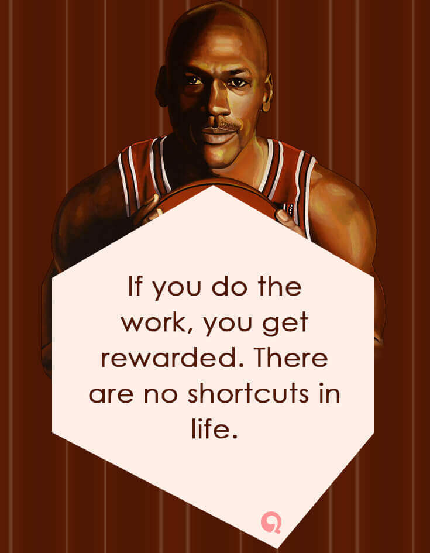

# Classroom

I always prioritize kindness, humility, and empathy. So, in the words of the old English calling, "Come ye, come all", take what you find useful, abandon what you don't and have lots of fun while you do this.

# Learning

1. Write the problem down
2. Think very hard
3. Write down the suggested solution
4. Explain the solution
5. Identify any gaps in understanding
6. Review, simplify and share the code

> "Tell me and I forget, teach me and I may remember, involve me and I learn." Benjamin Franklin

# Data Science

You don't need a computer science degree to become a data scientist so long as you have a concrete determination to learn. It takes every day working towards your goals. The formula to success is simply: hard work + motivation + courage + consistency.

# Machine Learning

I found this brilliant quote from 1987 by Michael Ault, on the topic of 'Garbage-in, Gospel-out', with a quote well worth to remember and equally applicable today: "Computers are complex, powerful, but very stupid machines. A computer does what it is told to do, not what you want it to do." 

# Dream Job

A firm regardless of the size where people with the best understanding of a particular problem are empowered and encouraged to exercise their voice and judgment.

# Team Work

Building a strong team doesn't guarantee success. But it gives you your best shot at it. 

> Computer scientist Hal Abelson has observed that "No matter how complex and polished the individual operations are, it is often the quality of the glue that most directly determines the power of the system."

# Myself

I believe that every woman/man is an artisan to her/his own fortune. I also believe that greatness is something you pursue, not something you achieve. It starts with holding your present self to higher standards than your past self. You do not get to lower the bar once you have made it. The higher you climb, the more responsible you are for continuing to raise it. And remember, “luck is the residue of preparation".

<!--
I had this very rare privilege of being able to pursue both in my academic and professional career what has been my dream; vast struggles with dispersed mathematics and statistical modeling, all of which are overlaid with ambition and sometimes astonishingly successful, while attempting to foretell the future of an industry that itself tries to foretell the future. I know this is a rare privilege, but if you can find your passion and focus all your time and efforts towards your goals, then it's more rewarding than anything imaginable.
-->

