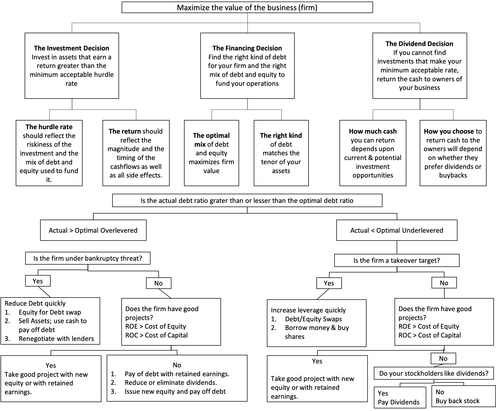

For the past decade I have extended [my lectures](https://www.linkedin.com/posts/rnfc_mathematics-genius-statistics-activity-6737461768458764288-fslU) far beyond what is labeled as corporate finance, introducing students to some reproducible examples that show how calculus can be used to estimate the optimal financing mix for companies across industries and regions. Starting with how the market is [pricing risk in the US and globally](https://rpubs.com/rafael_nicolas/crp), and then moving on to differences across companies on the [costs of capital](https://162tech.com/world.html#3_cost_of_capital). 

The complications with estimating the optimal capital structure lie in both the statistical problems with estimating risk parameters and with the valuation models themselves. There is a way of estimating costs of equity and capital that is agnostic about the choice of models, but it leads to circular reasoning, at least in the context of valuation. Noble Energy, Inc. (NasdaqGS:NBL) is an example of unsustainable debt-to-capital ratio levels. Pre-COVID they had actual debt to capital ratio of 41%, which represented 2 points below distressed levels of 43% and 26 points [above the optimal level of 15%](https://github.com/rnfermincota/academic/blob/master/teaching/traditional_assets/database/cases/case_noble_energy.xlsx). Here, the cost of capital operates as an optimizing tool for NBL’s capital structure where the price of risk is set by markets, and it enters the cost of capital in two places. When estimating the cost of equity, it manifests as an equity risk premium, and in the cost of debt computation, it is a default spread. Both are set by markets, reflect investor risk aversion and change over time and the approaches that we use to estimate them have to reflect this reality. 

Using this process, we estimated the cost of capital and target debt ratios for a total of [41,902 firms](https://github.com/rnfermincota/academic/blob/master/teaching/traditional_assets/database/). To get a sense of the target capital structure for each company after a most tumultuous year, we look at what each business can sustain in debt as they change the current debt to capital ratio to a target debt ratio. To estimate the cost of capital at different debt ratios, we first have to estimate the cost of equity at each debt ratio, and then estimate the interest coverage ratio, synthetic rating, and cost of debt, taking care to ensure that if the interest expenses exceed the operating income, tax benefits would be lost. 

In the post-virus economy, it is unlikely that the tax benefits of borrowing will surge but very likely that the expected bankruptcy costs will increase. It should come as no surprise, as [some companies are hamstrung by default and distress concerns](https://www.linkedin.com/posts/rnfc_hertz-carrental-chapter11-activity-6772747571510280192-vckM). Unfortunately, for some of these businesses, that debt will threaten their near future on growth and investment. For others, it will create opportunities and change in business plans as consumer confidence comes back quickly. There is a reason why Gary Kelly, chairman and CEO of Southwest Airlines, has been using the company’s capital structure as a [strategic weapon](https://www.linkedin.com/posts/rnfc_airtransporationindustry-activity-6677865758741053440-jTGZ). 

To summarize, the cost of capital is a ubiquitous metric for corporate executives, showing up in almost every aspect of their job description. It drives investing decisions, helps determine financing choices, and affects dividend policy and valuations. That being said, cost of capital is often mangled and misused in practice, and it seems that rather than operating within a range that minimize the cost of capital corporate executives are making financing choices [based upon perceptions of the cheapness (or costliness) of capital](https://www.linkedin.com/pulse/cost-capital-new-role-cfo-chief-figure-it-out-officer-fermin-cota).

Nico

Reference: [Damodaran, Aswath Applied Corporate Finance, 4th Edition ISBN 978-1-118-91857-9](https://www.wiley.com/en-us/Applied+Corporate+Finance%2C+4th+Edition-p-9781118918579)

